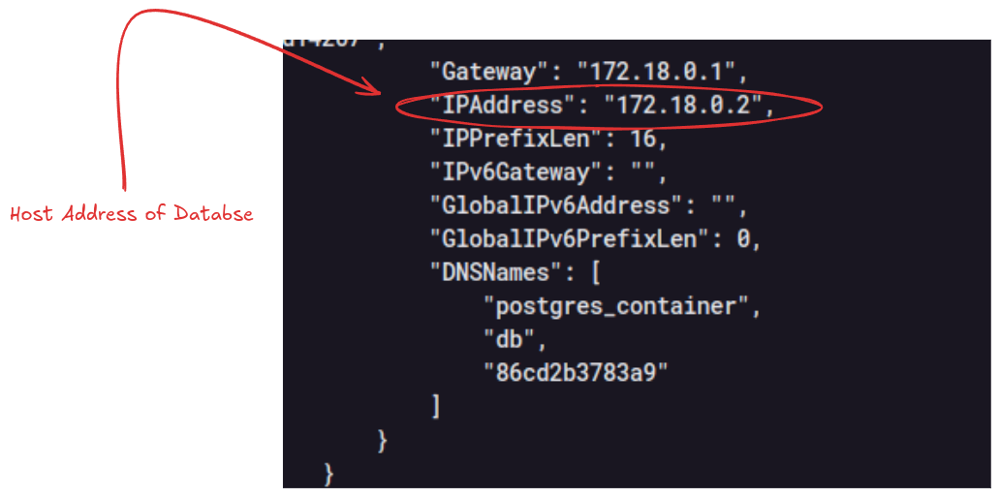
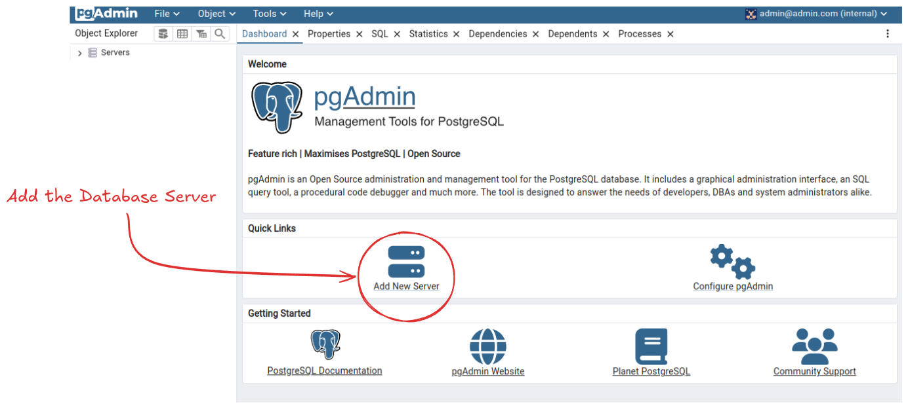
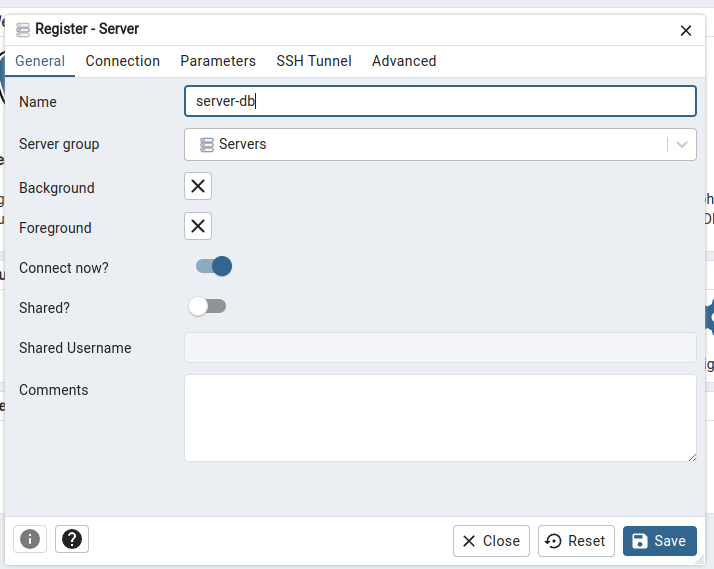
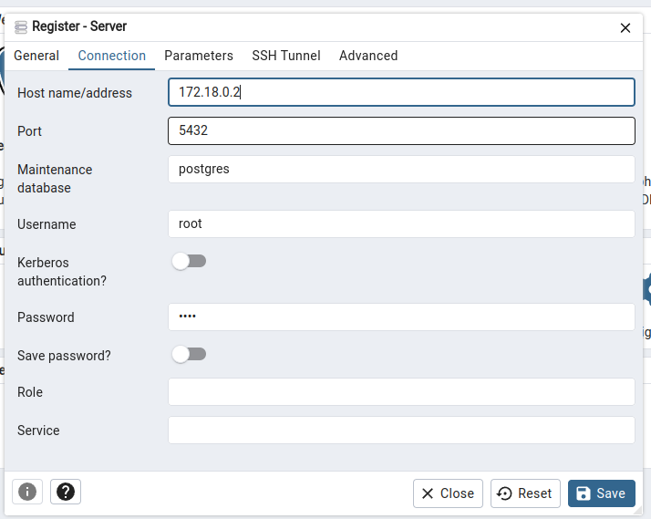
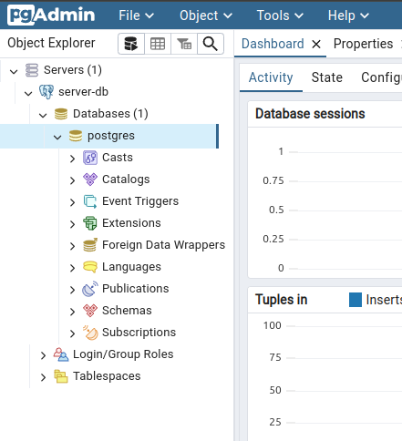

# Docker Compose PostgreSQL and PgAdmin


## Description

This is a simple example of how to use Docker Compose to create a PostgreSQL database and a PgAdmin instance to manage it.


## Setting up the environment

- Run the following command to initialize the containers:
    
```bash
docker-compose up -d
```

- Inspect the postgres_container to get the IP address of the PostgreSQL container and keep it for later use:
  
```bash
docker inspect postgres_container
```



- Access PgAdmin at http://localhost:5050 and login with the default credentials `PGADMIN_DEFAULT_EMAIL` and `PGADMIN_DEFAULT_PASSWORD` in the `docker-compose.yml` file. In this case the default credentials are email = `admin@admin.com` and password =  `root`.


- Add a new server in PgAdmin with the following information (The credentials are on the `docker-compose.yml` file, `POSTGRES_USER` and `POSTGRES_PASSWORD` variables):
    - Host name/address: The IP address of the PostgreSQL container
    - Port: 5432
    - Username: `root`
    - Password: `root`
  






## To update modifications in docker-compose.yml

```bash
docker compose up -d --build
```

## Connecting PgAdmin to PostgreSQL

- Access PgAdmin at http://localhost:5050


## To use the psql command line with the PostgreSQL container  in a specific database

```bash
docker exec -it postgres_container psql -U root -d database_name -W
```